# izzi Spark — Architecture Docs
> Diagrams com Mermaid para documentação técnica e visualização

---

## 1. Estrutura Organizacional

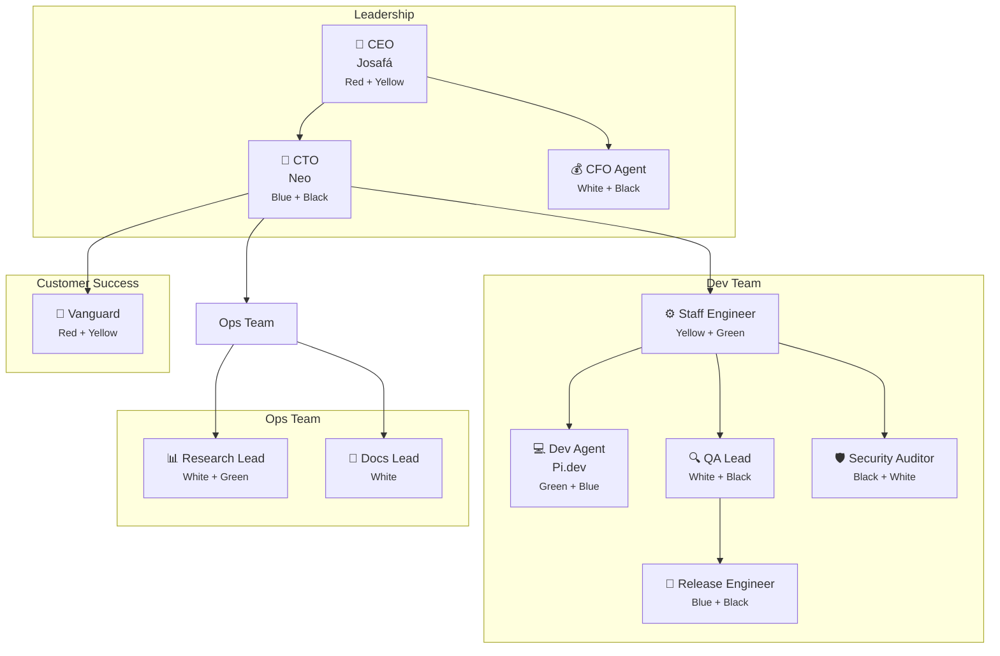

---

## 2. Hierarquia de Permissões (RBAC)

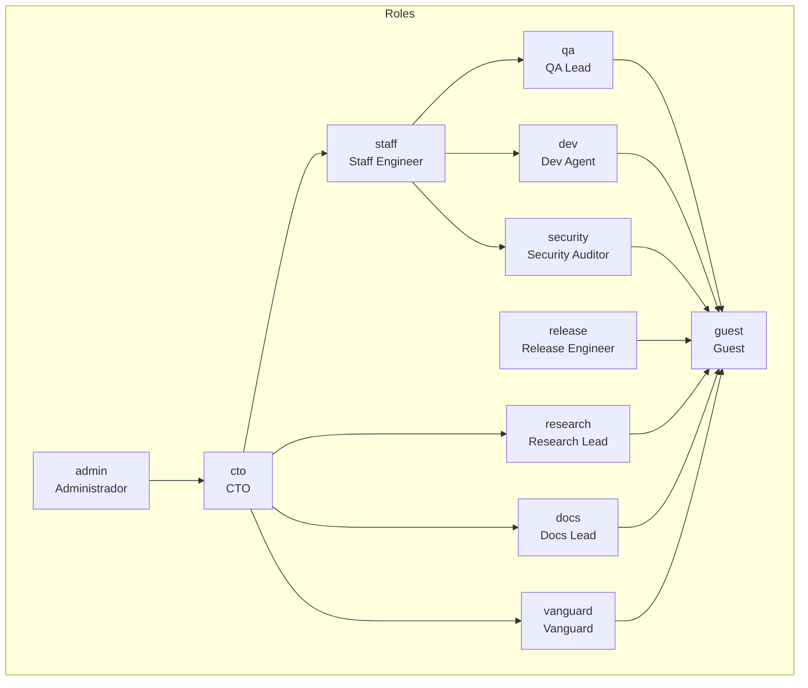

---

## 3. Tech Stack

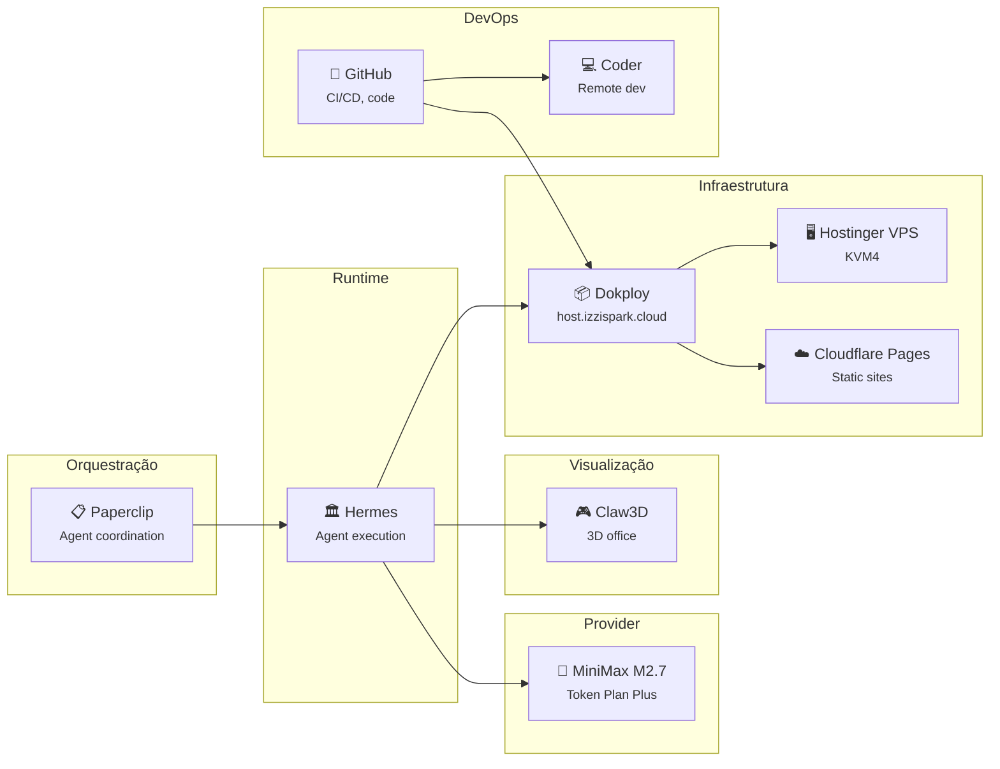

---

## 4. Fluxo de Decisão de Negócio

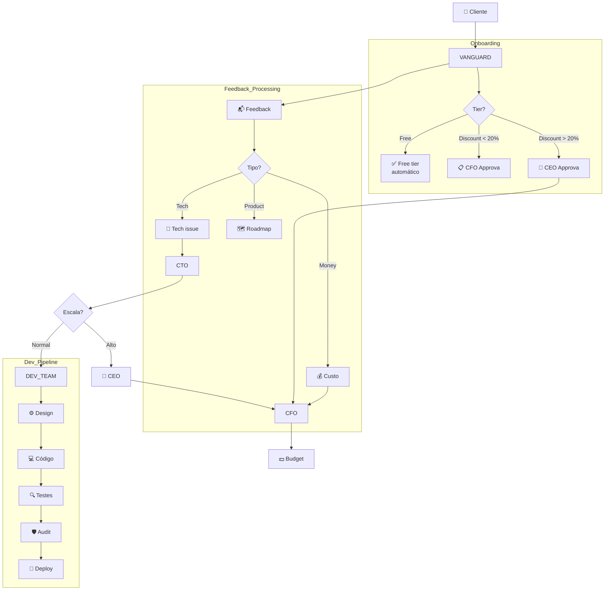

---

## 5. Fluxo de Delegação entre Agentes

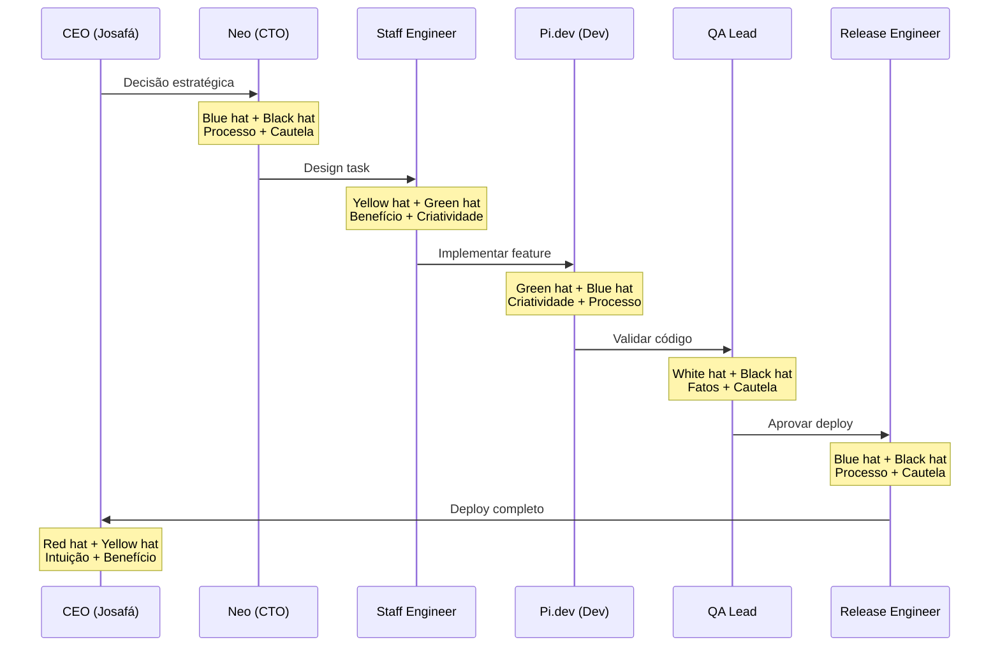

---

## 6. Fluxo de Dados (Agent → Auth Service)

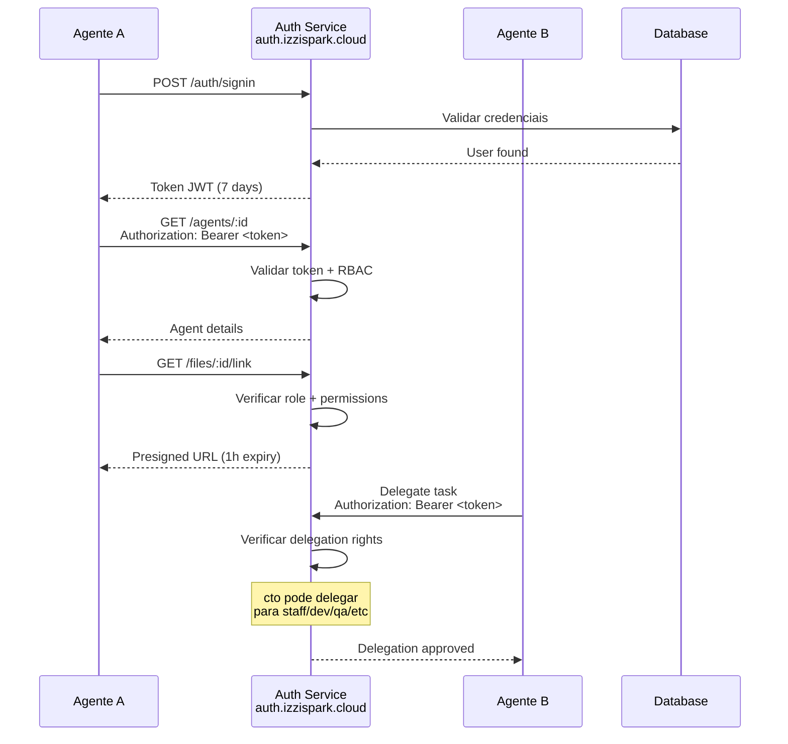

---

## 7. Diagrama de Infraestrutura (Deploy)

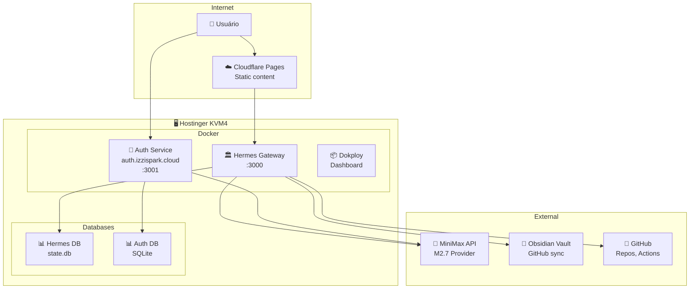

---

## 8. Estados de Gate de Aprovação

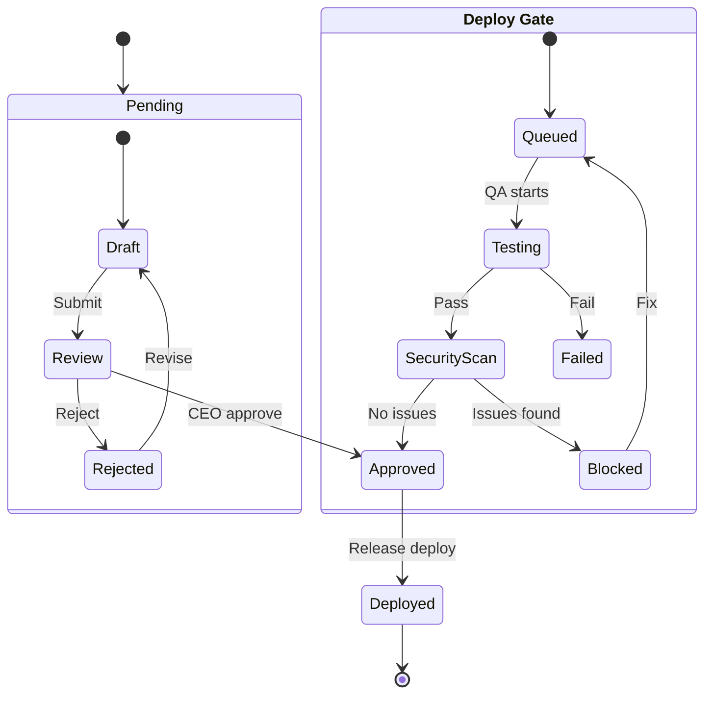

---

## 9. Role Permissions Matrix

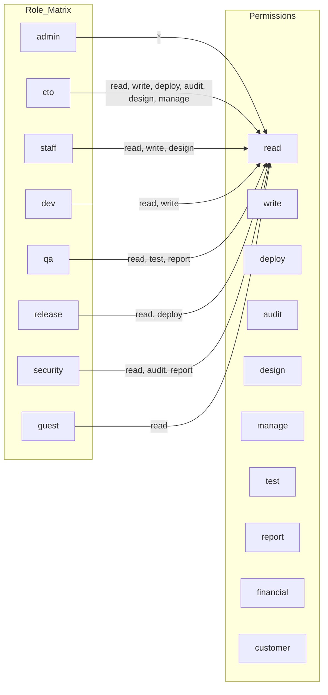

---

## 10. Fluxo de Feedback Loop

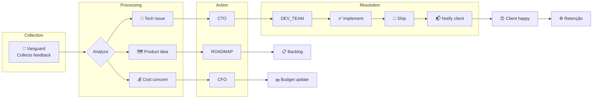

---

## 11. Agent-to-Agent Communication (Delegation Protocol)

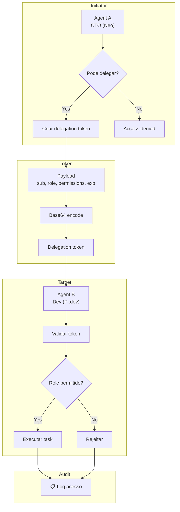

---

## 12. Six Thinking Hats Integration

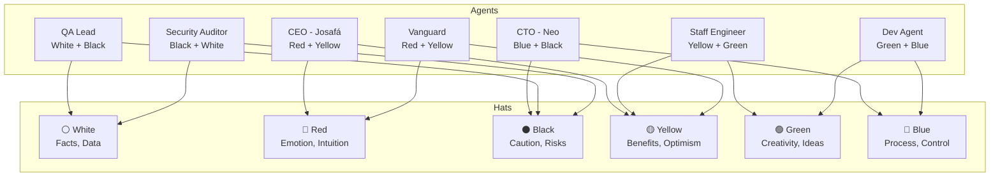

---

*Documentação gerada em Mai 2026*
*Versão 1.0 - izzi Spark Architecture*